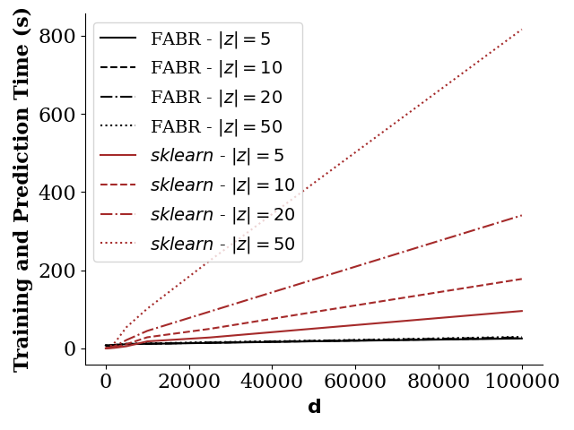

# A Simple Algorithm For Scaling Up Kernel Method

This repository contains the code and supplementary material for the paper: A Simple Algorithm For Scaling Up Kernel Method.

Conventional wisdom suggests kernel methods are unsuitable for large samples due to their computational complexity and memory requirements. 
We introduce a novel random feature regression algorithm that allows us (when necessary) to scale to virtually _infinite_ numbers of random features. We illustrate the performance of our method on the CIFAR-10 dataset.

# Requirements:
We've run all the experiments using Python3.7+.

Before starting, please create a virtual environment, then:
```bash
python3 -m pip install --upgrade pip
python3 -m pip install -r requirements
python3 setup.py develop
```
# Reproduce Results

To reproduce all the results shown in the paper:

```bash
python3 experiments/sklearn_vs_spectral_speed.py

# FABR
./train_all.sh

# Tables
./tables.sh

# Plots
./voc_curves.sh
```

# A Comparison with _sklearn_

In this section, we show FABR's training and prediction time with respect to the number of features $d$. To this end, we do not use any random feature projection or the rank-$\nu$ matrix approximation described in the paper. We generate synthetic datasets and train both FABR and _sklearn.linear_model.RidgeClassifier_ with different number of regularizers ($|z|$). We average the training times over 10 independent runs.
<center>

</center>


**Note** that if you're an AMD user, you might incur inconsistent results. That is because _numpy_ relies heavily on the C libraries, such as Basic Linear Algebra Subprograms (BLAS), Linear Algebra Package (LAPACK), etc. It happens that _numpy_ on Intel machines highly relies on the Math Kernel Library (MKL), while AMD relies on OpenBLAS. Hence, if you're an AMD user and you incur incosistent result please follow this thread: <br>
[Why is Numpy with Ryzen Threadripper so much slower than Xeon?](https://stackoverflow.com/questions/62783262/why-is-numpy-with-ryzen-threadripper-so-much-slower-than-xeon). <br>

To understand your backend C linear algebra library simply run:
```bash
import numpy
numpy.show_config()
```

**_Update_** We've run the experiments on a M1 Pro chip. These new Apple's chips use OpenBlas and the results hold.


# Experiments on CIFAR-10

For further evaluation, we assess FABR's performance on both small and big dataset regimes. For all experiments, we perform a random features kernel ridge regression with respect to demeaned one-hot labels and solve the optimization problem using FABR, FABR-$\nu$, and FABR with mini-batches.
<br>
We compare FABR's performance on the subsampled CIFAR-10 datasets with ResNet-34 and CNTK as shown in (Arora et al., 2019)[](https://arxiv.org/abs/1910.01663). We are well aware of the work of (Shankar et al., 2020) [](https://arxiv.org/abs/2003.02237). However this paper aims to offer a highly scalable ridge regression scheme based on random features. Computing the random features underlying the Neural Kernels would require developing non-trivial numerical algorithms based on the recursive iteration of non-linear functions. We leave this as an important direction for future
research.
The table below shows FABR outperforming both ResNet-34 and CNTKs in the subsampled CIFAR-10. For further experiment details, see the paper's Section 4.

| n    | ResNet-34            | 14-layer CNTK        | z=1                  | z=100                         | z=10000                       | z=100000             |
|------|----------------------|----------------------|----------------------|-------------------------------|-------------------------------|----------------------|
| 10   | 14.59\% $\pm$ 1.99\% | 15.33\% $\pm$ 2.43\% | 18.50\% $\pm$ 2.18\% | **18.50\% $\pm$ 2.18\%** | 18.42\% $\pm$ 2.13\%          | 18.13\% $\pm$ 2.01\% |
| 20   | 17.50\% $\pm$ 2.47\% | 18.79\% $\pm$ 2.13\% | 20.84\% $\pm$ 2.38\% | **20.85\% $\pm$ 2.38\%** | 20.78\% $\pm$ 2.35\%          | 20.13\% $\pm$ 2.34\% |
| 40   | 19.52\% $\pm$ 1.39\% | 21.34\% $\pm$ 1.91\% | 25.09\% $\pm$ 1.76\% | 25.10\% $\pm$ 1.76\%          | **25.14\% $\pm$ 1.75\%** | 24.41\% $\pm$ 1.88\% |
| 80   | 23.32\% $\pm$ 1.61\% | 25.48\% $\pm$ 1.91\% | 29.61\% $\pm$ 1.35\% | 29.60\% $\pm$ 1.35\%          | **29.62\% $\pm$ 1.39\%** | 28.63\% $\pm$ 1.66\% |
| 160  | 28.30\% $\pm$ 1.38\% | 30.48\% $\pm$ 1.17\% | 34.86\% $\pm$ 1.12\% | 34.87\% $\pm$ 1.12\%          | **35.02\%** $\pm$ 1.11\% | 33.54\% $\pm$ 1.24\% |
| 320  | 33.15\% $\pm$ 1.20\% | 36.57\% $\pm$ 0.88\% | 40.46\% $\pm$ 0.73\% | 40.47\% $\pm$ 0.73\%          | **40.66\% $\pm$ 0.72\%** | 39.34\% $\pm$ 0.72\% |
| 640  | 41.66\% $\pm$ 1.09\% | 42.63\% $\pm$ 0.68\% | 45.68\% $\pm$ 0.71\% | 45.68\% $\pm$ 0.72\%          | **46.17\% $\pm$ 0.68\%** | 44.91\% $\pm$ 0.72\% |
| 1280 | 49.14\% $\pm$ 1.31\% | 48.86\% $\pm$ 0.68\% | 50.30\% $\pm$ 0.57\% | 50.32\% $\pm$ 0.56\%          | **51.05\% $\pm$ 0.54\%** | 49.74\% $\pm$ 0.42\% |

## Double Descent and the Virtue of Complexity on the subsampled CIFAR-10 dataset
| <center><em>$n = 10$</em></center> | <center><em>$n = 20$</em></center>  | <center><em>$n = 40$</em></center> | <center><em>$n = 80$</em></center>
|-----------------------------------|-------------------------------------|-------------------------------------|-------------------------------------|

| <center><em>$n = 160$</em></center> | <center><em>$n = 320$</em></center>  | <center><em>$n = 640$</em></center> | <center><em>$n = 1280$</em></center>
|-----------------------------------|-------------------------------------|-------------------------------------|-------------------------------------|

These figures show FABR’s test accuracy increases with the model’s complexity $c$ on different ($n$) subsampled CIFAR-10 datasets. The expanded datasets ($n \in \{2560, 5120, 10240, 20480, 50000\}$) follow similar patterns. We truncate the curve for c > 25 to show the double descent phenomena better.
The full curves are shown in the paper Appendix B. Notice that when the shrinkage is sufficiently high, the double descent disappears, and the accuracy is monotonically increasing in complexity. Following (Kelly et al., 2022), we name this phenomenon the virtue of complexity (VoC). The test accuracy is averaged over 20 independent runs.

# More experiments on the expanded CIFAR-10 dataset

We run the same experiment on the expanded dataset for both FABR-$\nu$ and mini-batch FABR. We observe that the double descent phenomenon naturally appears for both FABR-$\nu$ and the mini-batch FABR but only when $\nu \approx n$ or $\text{batch size} \approx n$. However, the double descent phenomenon disappears when $\nu \ll n$; see figures below. Moreover, surprisingly, both the mini-batch FABR and FABR-$\nu$ sometimes achieve higher accuracy than the full sample regression on moderately-sized datasets. See Tables 2 and 3 in the paper. Understanding these phenomena is an interesting direction for future research.

FABR-$\nu$ trained on the subsampled and full sample CIFAR-10 dataset, respectively. We use $\nu=2000$

| <center><em>$n = 2560$</em></center> | <center><em>$n = 50000$</em></center>  
|-----------------------------------|-------------------------------------|

Mini-batch FABR trained on the subsampled and full sample CIFAR-10 dataset, respectively. We use $\text{batch size}=2000$

| <center><em>$n = 2560$</em></center> | <center><em>$n = 50000$</em></center>  
|-----------------------------------|-------------------------------------|

<!--
# Generating the MNIST-8M dataset

The 8M dataset is the original MNIST dataset images + 134 distortions of the original. Hence, there are:
135*60,000 = 8,100,000
We generate the MNIST-8M dataset following directly the main author guidelines provided in (The infinite MNIST dataset)[https://leon.bottou.org/projects/infimnist].<br>
Simply follow the guidelines provided and move the generated labels and patterns to the data folder:

```bash
mv mnist8m-labels-idx1-ubyte project-directory/data/MNIST
mv mnist8m-patterns-idx3-ubyte project-directory/data/MNIST
```

Following (Avron et al, 2016)[](https://arxiv.org/abs/1611.03220), we sample randomly 1M samples out of MNIST-8M to create our MNIST-1M dataset.
-->